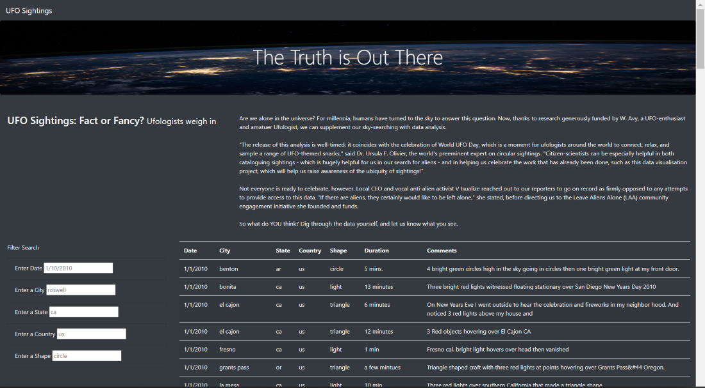
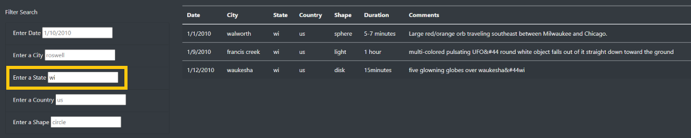
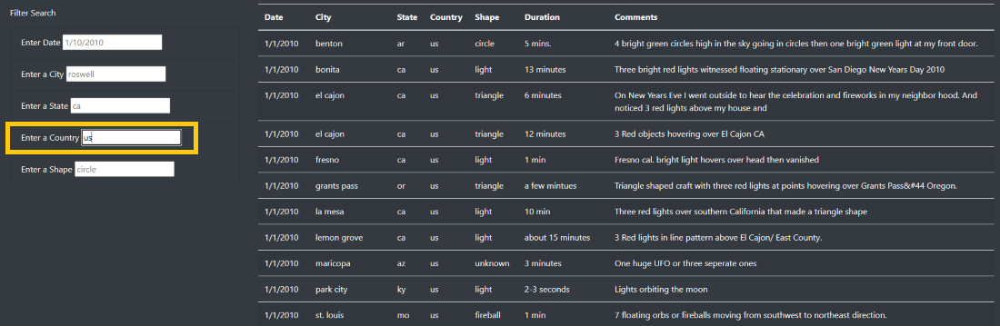
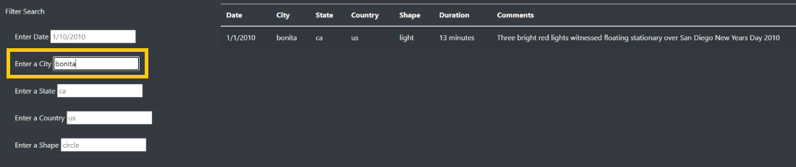
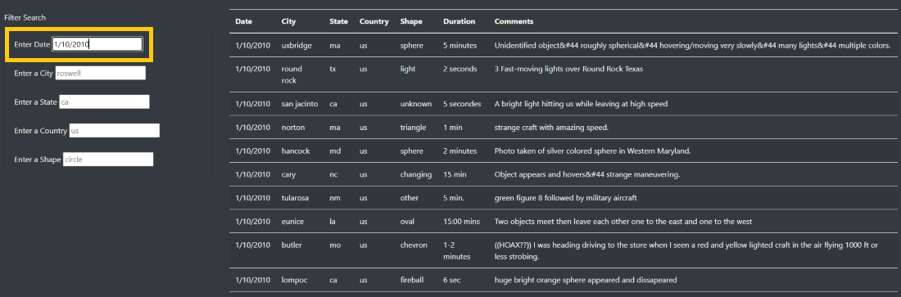
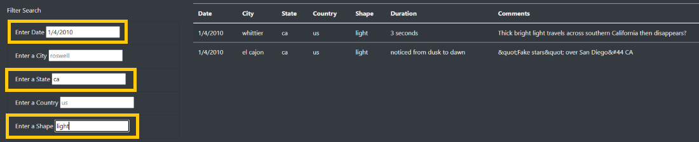
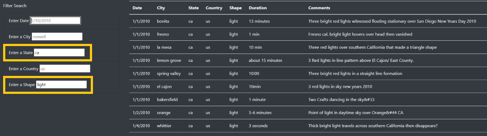

# UFOs

## Overview of UFO Sighting Analysis
We were tasked with helping create a dynamic webpage that would display UFO sighting data based on criteria specified by user input. This webpage was created to filter the UFO sightings by date, city, state, country and shape. 

## Results of UFO Sighting Analysis

### UFO Sightings webpage link
Webpage accessible at https://trevoriwen.github.io/UFOs/.

### Default page
The default page when you follow the link gives you the full table of UFO Sightings with all filters cleared out. This allows you to see all the data that the table contains.

### Using the search filter

**Conducting a search**

To use the filter you just need to input the search term you are trying to filter by into the proper input box and press enter. This will require you to enter the value of the search term exactly as it is in the data, following all date formatting as well as no capitalization. 

For example, if you want to find all the UFO sightings in the state of Wisconsin, you will enter “wi” in the input box directly below “Enter State” and press enter. This will then output only sightings where the state equals “wi”, giving you 3 UFO sightings. 

You can follow the same process for all 5 filters, as long as you enter a matching value in the data, such as “us” for country, “bonita” for city, or “1/10/2010” for date.

**Combining search filters**

The filters can be combined to complete a more narrowed search. Using multiple filters in a search creates an AND statement and will only show the values that fit all of the filters applied. For example, if you want to search only UFO sightings that have a light shape that occurred in the state of California on 1/4/2010, you can enter the values into each input box and when all three are inputted you will see the table output 2 sightings, one in whittier and one in el cajon.

**Expanding a narrowed search**

At any time you can expand a narrowed search by deleting one of the values in the filtered search and press enter and the table will open up the search. For example, if you use the prior search for UFO sightings that have a light shape that occurred in the state of California on 1/4/2010, and decide you don’t care what date the sighting occurred you can delete the “1/4/2010” in the Enter Date search box and press enter. This will give you a table with just shape equal to light and state equal to ca in the data.

### Returning to the default page
You can delete all values in the search in order to get back to the full table, much like expanding your search, but you can also click the “UFO Sightings” header in the upper left corner of the page and that will reset the filters.

## Summary of UFO Sighting Analysis

### Drawback
The main drawback to this webpage’s design that sticks out is what the search criteria will accept and what the user will know what to search. If the user capitalizes the city, state, or country like many would, the search will come back empty. The user would also have to look through the full table in order to find what the values they could search for in the form.

### Further Web Page Development
- In order to help address the drawback pointed out, I would suggest creating the filters as a drop down option so the user knows exactly what is available to search and the format that would be accepted.
- Another development would be making each column sortable. Right now the user only has the option to view the order by date. If the user wanted to find the sightings with the longest duration for their search they would still have additional work to find which sightings had the longest duration.  
